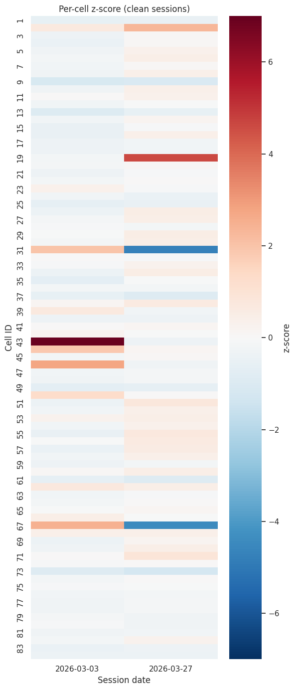
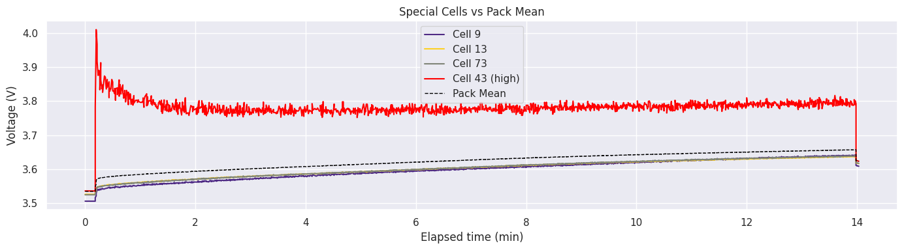
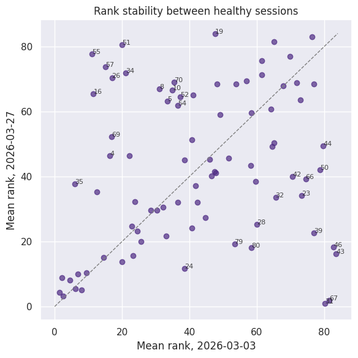
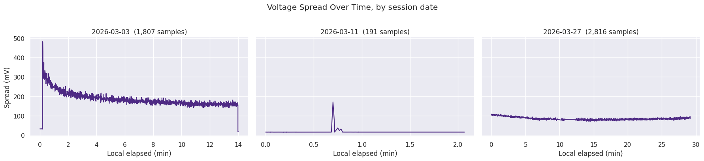
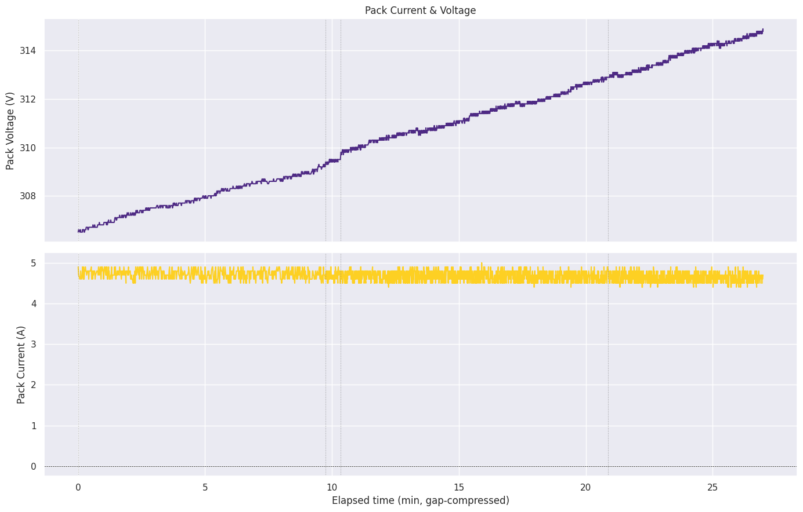

# Tiger Racing BMS Analysis

> Forensic cell-voltage analysis of an 84-cell FSAE accumulator. Reads raw BMS
> logs to find the weak cells before they fail on track.

[](https://www.python.org)
[](https://jupyter.org)
[](https://pandas.pydata.org)
[](https://www.lsu.edu)



## What it is

LSU Tiger Racing runs a Formula SAE car with an 84-cell high-voltage accumulator.
The BMS logs every cell's voltage, resistance, and open-cell voltage about once a second.
This repo turns those raw `cellvoltages_*.csv` exports into one repeatable diagnostic: which
cells are genuinely weak, and which just had an off day?

The heatmap above answers it. Columns are sessions, rows are cells. Cells that stay red or
blue across sessions are real signal; a lone off-color square is noise. Cells **31** and
**67** light up in both healthy sessions, and both turned out to be driving an active fault.

## The headline finding



On **2026-03-03**, cell 43 sat ~6.9σ above the pack mean, holding ~3.8 V while the rest
tracked near 3.6 V. Anomalous, but not yet failed.

Eight days later it collapsed to ~0 V mid-session (−9.1σ) and the BMS dropped pack voltage.
The tell was there a week early: a cell reaches higher voltage faster because it has less
capacity, then dies.

Cells 31 and 67 now show the same signature. By **2026-03-27** they were the two dominant
low-side outliers, the BMS had raised a **P0A80 Weak Cell** fault, and it had throttled
discharge current from 198 A to 100 A. Two named cells, one measurable performance hit.

## Highlights

- **Called the failure early.** Cell 43's degradation signature was flagged a full session
  before it collapsed, and cells 31/67 were named as the P0A80 drivers.
- **Cross-session trend engine.** [`trends.ipynb`](notebooks/trends.ipynb) rolls every session
  into per-cell z-scores, rank stability, and load residuals, so a bad day reads differently
  from a bad cell.
- **Load-residual IR diagnostic.** Median `V_loaded − OCV` under `|I| ≥ 1 A` surfaces cells
  whose weakness hides behind internal resistance during charge.
- **Fault-aware by design.** The 2026-03-11 fault session is dropped from trend metrics on
  purpose; a −9σ dead cell would flatten every other cell toward zero in the heatmap.
- **One source of truth.** Loading, cleaning, and per-cell math all live in
  [`bms_utils.py`](notebooks/bms_utils.py). Notebooks stay on the story.

## Cross-session trends

| | |
|---|---|
|  |  |
| **Rank stability.** Each cell's mean rank in one session vs. another. Cells off the diagonal changed standing between sessions; 31, 43, and 67 are the movers. | **Voltage spread per session.** Highest minus lowest cell at each timestamp. A healthy pack converges under charge; the 2026-03-11 spike is cell 43 dying mid-session. |

## Per-session diagnostics

Every session notebook runs the same arc: pack behavior over time, then spread, then per-cell
z-scores, then the cells to watch. Below, the 2026-03-27 charge: clean monotonic voltage rise
at a steady ~4.6 A.



## Notebooks

| Notebook | What it covers |
|---|---|
| [`collate.ipynb`](notebooks/collate.ipynb) | Loads every raw CSV, cleans it, sanity-checks sampling, writes `data/collated.parquet`. |
| [`session_2026-03-03.ipynb`](notebooks/session_2026-03-03.ipynb) | First healthy session. Flags cell 43 at +6.9σ. |
| [`session_2026-03-11.ipynb`](notebooks/session_2026-03-11.ipynb) | Fault session. Cell 43 collapses to ~0 V. |
| [`session_2026-03-27.ipynb`](notebooks/session_2026-03-27.ipynb) | Four back-to-back runs. Diagnoses the P0A80 fault and DCL throttling to cells 31/67. |
| [`trends.ipynb`](notebooks/trends.ipynb) | Cross-session z-score heatmap, rank stability, load-residual trends. |

## Method

`bms_utils.py` is the shared toolkit every notebook builds on:

- `load_session` strips whitespace, drops the BMS trailing-empty column, sign-flips Pack
  Current so positive means charging, parses TZ-suffixed timestamps, tags each row with
  `elapsed_s` and `session_id`.
- `cell_voltage_z` gives a per-cell mean-voltage z-score across the 84-cell distribution.
- `cell_mean_rank` gives a per-cell mean rank per row (1 = lowest), the basis for rank stability.
- `load_residual_mv` gives median `V_loaded − OCV` under load, an internal-resistance proxy.
- `apply_lsu_style` keeps the LSU purple/gold theme consistent across every figure.

## Data

Raw exports live in `data/raw/`, one `cellvoltages_<timestamp>.csv` per run, and collate into
`data/collated.parquet`. Voltages are per-cell; the pack is 84 cells in series.

## Quickstart

```bash
git clone https://github.com/cordialApple/tiger-racing-bms-analysis.git
cd tiger-racing-bms-analysis
python -m venv venv && source venv/Scripts/activate   # Windows Git Bash
pip install -r requirements.txt
jupyter lab
```

Run `collate.ipynb` first to build the parquet, then any session or the trends notebook.

## Repo layout

```
data/
  raw/                     raw cellvoltages_*.csv exports
  collated.parquet         cleaned, concatenated sessions
notebooks/
  bms_utils.py             shared load + per-cell metrics
  collate.ipynb            build the parquet
  session_*.ipynb          per-session EDA
  trends.ipynb             cross-session trends
docs/images/               figures surfaced in this README
```
